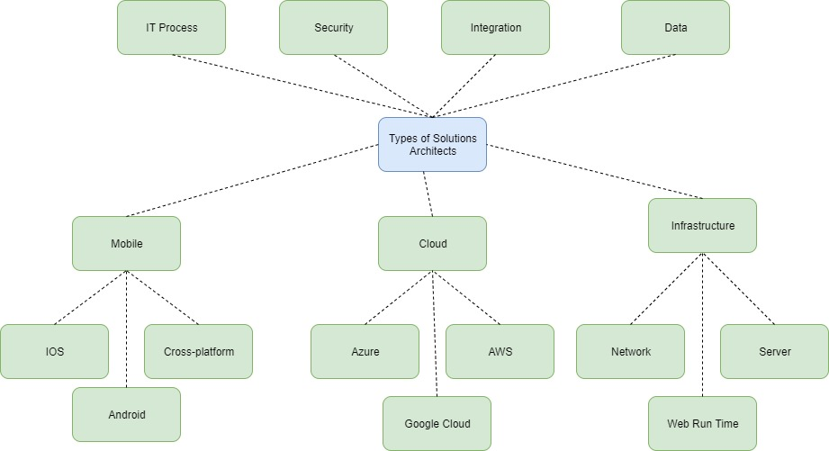

# 通往軟體架構師的道路

> * 原文地址：[通往軟體架構師的道路](https://github.com/justinamiller/SoftwareArchitect)
> * 原文作者：[Justin Miller(justinamiller)](https://github.com/justinamiller)
> * 翻譯：[NeroCube](https://github.com/NeroCube)

翻譯:

[English](https://github.com/justinamiller/SoftwareArchitect) |
[繁體中文](https://github.com/NeroCube/software-architect-zh-tw)

## 內容
- [什麼是軟體架構師](#什麼是軟體架構師)
- [架構等級](#架構等級)
- [典型活動](#典型活動)
- [重要技能](#重要技能)
- [架構師技術路線圖](#架構師技術路線圖)
- [解決方案架構師類型](#解決方案架構師類型)
- [推薦書籍](#推薦書籍)

# 什麼是軟體架構師
* 軟體架構師是一位軟體專家，他可以進行高層設計架構選擇並決定技術標準，包括軟體編碼標準，工具和平台。（來源：維基百科：軟體架構師）
* 軟體體系結構是系統的基本組織，由其組件，它們之間的相互關係以及與環境的關係以及確定係統設計和演進的原理來表示。 （來源：軟件體系結構手冊）

# 架構等級
架構可以抽象為幾個層次。水平會影響必要技能的重要性。

由於存在許多可能的分類，因此我喜歡細分成以下3個級別：
* **應用程序層級**: 最低級別的架構. 專注於一個單一的應用程序。非常詳細的底層設計。通常在一個開發團隊中進行溝通。
* **解決方案層級**: 中間層級的架構. 專注於滿足業務需求（業務解決方案）的一個或多個應用程序之中一些高層次但主要是低層次的設計。多個開發團隊之間的溝通。
* **企業層級**: 最高級別的體系結構。專注於多種解決方案。高層次的抽象設計, 需要解決方案或應用程序架構師進行詳細說明. 整個組織的溝通. 參閱 [Link](https://github.com/justinamiller/EnterpriseArchitecture) to learn more.

有時，架構師也被視為不同利益相關者之間的“膠水”。

三個例子：
* **水平**：橋接業務與開發人員或不同開發團隊之間的溝通。
* **垂直**：在開發人員和管理人員之間架起溝通橋樑。
* **技術**：相互集成不同的技術或應用程序。

# 典型活動
要了解架構師所需的必要技能，我們首先需要了解典型活動。 我認為以下列表包含最重要的活動：

* 定義並確定開發技術和平台
* 定義開發標準，例如編碼標準，工具，審查流程，測試方法等。
* 支持識別和理解業務需求
* 設計系統並根據需求做出決策
* 記錄並傳達架構定義，設計和決策
* 檢查和審查架構和代碼，例如，檢查定義的模式和編碼標準是否正確實施
* 與其他架構師和商業關係人合作
* 指導並諮詢開發商
* 詳細說明並將高階設計改進為低階設計

   _注意：系統架構是一項連續的活動，尤其是在將其應用於敏捷軟件開發中時。 因此，這些活動需一遍又一遍地進行。_

# 重要技能
為了支持佈局活動，需要特定技能。 根據我的經驗經過閱讀書籍和討論，我們可以將其總結為每個軟件架構師應具備的十項技能：
   * 設計
   * 決策
   * 簡化
   * 代碼
   * 文件
   * 溝通
   * 評估 
   * 權衡
   * 諮詢
   * 市場

## (1) 設計
如何做一個好的設計? 這可能是最重要和最具挑戰性的問題. 我將在理論和實踐之間進行區分。 以我的經驗，兩者的結合是最有價值的。 讓我們從理論開始:

* **了解基本設計模式**: 模式是架構師開發可維護系統所需的最重要工具之一。 使用模式，您可以重複使用設計，以通過可靠的解決方案解決常見問題。John Vlissides，Ralph Johnson，Richard Helm和 Erich Gamma 撰寫的 Design Patterns: Elements of Reusable Object-Oriented Software 是所有從事軟體開發的人必讀的書。儘管該模式已發布20多年，但它們仍然是現代軟體開發架構的基礎。 例如，本書描述了模型-視圖-控制器（MVC）模式，該模式在許多領域都得到了應用，或者是更新模式的基礎，例如 MVVM。
* **深入研究模式和反模式**: 如果您已經了解所有基本的 GoF 模式，則可以使用更多的軟體設計模式來擴展你的知識。 或更深入地研究您感興趣的領域。我最喜歡的應用程序集成之一是 Gregor Hohpe 撰寫的“ Enterprise Integration Patterns”一書。 無論兩個應用程序需要交換數據，無論是來自某些舊系統的舊式文件交換還是現代微服務體系結構的交換，這本書都適用於各個領域。
* **了解品質衡量**: 定義架構並不是終點。 它有定義、應用和控制指南和編碼標準的原因。 您出於質量和非功能性要求而這樣做。 您想要的是一個可維護，可靠，適應性強，安全，可測試，可擴展，高可用的系統。要實現所有這些質量屬性，一件事情就是應用良好的架構工作。 您可以在維基百科上了解更多關於品質衡量。
理論很重要。 如果您不想成為像牙塔架構師，那麼實踐同樣重要，甚至更為重要。

* **嘗試並了解不同的技術堆棧**: 如果您想成為一名更好的架構師，我認為這是最重要的活動。 試用（新）技術堆棧，並了解它們的興衰。不同或新技術具有不同的設計方面和模式。 您很可能從翻閱抽象幻燈片中不會學到任何東西，但可以試著自己嘗試一下，並感受期待來的痛苦或緩解。 架構是不應該只有廣度也需要在某些領域有較深的知識。掌握所有技術堆棧並不重要，但要對您所在領域最重要的知識，有深入的了解。另外嘗試不屬於你領域的技術，例如：如果你專研 SAP R/3 你應該也試試 JavaScript ，反之亦然. 儘管如此，雙方仍會對 SAP S/4 最新進展感到驚訝哈哈哈。例如，您可以自己嘗試看看 SAP S/4，然後上 openSAP 的免費課程。 好奇並嘗試新事物。 還可以嘗試一些您幾年前不喜歡的東西。
* **分析和理解應用模式**: 看一下當前的任何框架，例如Angular。 您可以在實踐中研究很多模式，例如“可視化”。 嘗試了解它如何在框架中應用，為什麼要這樣做。 而且，如果您真的很專心，請更深入地研究代碼並了解其實現方式。
* **好奇並參加用戶群**. [聚會](https://www.meetup.com/)

## (2) 決策
架構師需要能夠做出決定並指導項目或整個組織朝正確的方向發展。

* **知道什麼是重要的**: 不要浪份實踐做不重要的決策 或活動。學習什麼是重要的 據我所知，沒有一本書包含這些信息。我個人的最愛是這兩個特徵，我通常會在評估某些事情是否重要時考慮這些特徵: 
  1. 概念完整性: 如果您決定以一種方式進行操作，請堅持執行，即使有時最好以其他方式進行。 通常，通常使得整體概念，易於理解並易於維護。。
  2. 一致性: 例如，如果您定義並應用命名規範 它不是大寫或小寫，而是以相同的方式將其應用到所有地方。
* **優先排序**: 一些決定非常關鍵。 如果不及早採取措施，則會形成足夠的解決方法，這些解決方法通常不太可能在以後刪除，這是維護的噩夢, 或更糟糕的是，開發人員直接停止工作直到做出決定。在這種情況下，有時最好做出“錯誤”的決定而不是沒有做決定。 但是在遇到這種情況之前，請考慮優先考慮即將做出的決定。有不同的方法可以做。 我建議看一下在敏捷軟件開發中廣泛使用的加權最短作業優先（WSJF）模型。 特別是時間緊迫性和風險降低措施對於評估架構決策的優先順序非常關鍵。
* **知道你的權責**: 不要決定不在你權責內的事。這很關鍵，因為如果不考慮的話，它可能會嚴重破壞您作為架構師的地位。 為避免這種情況，請與您的同伴明確您要承擔的責任以及角色的一部分。 如果架構師不止一個，那麼您應該尊重當前部署的架構級別。 作為較低級別的架構師，您最好提出有關高層架構的建議，而不是決策。此外，我建議總是與同伴一起檢查關鍵決策。
* **評估多個選項**: 如果涉及到決策，請務必提出多個選擇。 在我參與的大多數情況下，都有不止一種可能的（好的）選擇。 從兩個方面講，僅選擇一個選項是不好的: 首先，似乎您的工作做得不好，其次，它阻礙了做出正確的決定。 通過定義度量，可以基於事實而不是直覺來比較選項， 例如：授權費用或期限。 這通常會導致更好和更可持續的決策。 此外，可以輕鬆地將決策出售給不同的利益相關人。 此外，如果您沒有正確評估選項，則在討論中可能會失去論點。

## (3) Simplify
Keep in mind the problem-solving principle Occam’s Razor which states to prefer simplicity. I interpret the principle as following: If you have too many assumptions about the problem to solve your solution will probably be wrong or lead to an unnecessary complex solution. Assumptions should be reduced (simplified) to come to a good solution.

* **Shake the solution**: To get solutions simplified, it often helps to “shake” the solution and look at them from different positions. Try to shape the solution by thinking top-down and again bottom-up. If you have a data flow or process, then first think left to right and again right to left. Ask questions such as: “What happens to your solution in a perfect world?” Or: “What would company / person X do?” (Where X is probably not your competitor, but one of the GAFA (Google, Apple, Facebook, & Amazon) companies.) Both questions force you to reduce assumptions as suggested by Occam’s Razor.
* **Take a step back**: After intense and long discussions, highly complex scribbles are often the results. You should never ever see these as the final results. Take a step back: Have a look at the big picture again (abstract level). Does it still make sense? Then go through it on the abstract level again and refactor. Sometimes it helps to stop a discussion and continue the next day. At least my brain needs some time to process and to come up with better, more elegant and simpler solutions.
* **Divide and Conquer**: Simplify the problem by dividing it into smaller pieces. Then solve them independently. Afterwards validate if the small pieces match together. Take the step back to have a look at the overall picture for this.
* **Refactoring is not evil**: It is totally ok to start with a more complex solution if no better idea can be found. If the solution is making troubles you can later rethink the solution and apply your learning. Refactoring is not evil. But before you start refactoring, keep in mind to have (1) enough automated tests in place which can ensure the proper functionality of the system and (2) the buy-in from your stakeholders. To learn more about refactoring I suggest reading “Refactoring. Improving the Design of Existing Code” by Martin Fowler.

## (4) Code
Even as an Enterprise Architect, the most abstract level of architecture, you should still know what developers are doing on their daily basis. And if you do not understand how this is done, you may face two major problems: 
  1. Developers won’t accept your sayings. 
  2. You do not understand challenges and needs of developers.

* **Have a side project**: The purpose of this is to try out new technologies and tools to find out how development is done today and in the future. Experience is the combination of observations, emotions and hypothesis (“Experience and Knowledge Management in Software Engineering” by Kurt Schneider). Reading a tutorial or some pros and cons is good. But this is just “book knowledge”. Only if you try out things by yourself you can experience emotions and can built up hypothesis about why something is good or bad. And the longer you work with a technology the better your hypothesis will get. This will help you to take better decisions in your day to day work. As I started programming I had no code completion and only some utility libraries to speed up development. Obviously, with this background I would make wrong decisions today. Today, we have tons of programming languages, frameworks, tools, processes and practices. Only if you have some experience and a rough overview in the major trends you are able to take part of the conversation and to steer development into the right direction.
* **Find the right things to try out**: You cannot try out everything. This is simply impossible. You need a more structured approach. One source I recently discovered is the Technology Radar from ThoughtWorks. They categorize technologies, tools, platforms, languages and frameworks into four categories: Adopt, Trial, Assess and Hold.  With this categorization it is easier to get an overview of new things and their readiness to better evaluate which trend to explore next.
  * Adopt: “strong feeling to be ready for enterprise usage”.
  * Trial: “enterprise should try it in one project that can handle the risk”.
  * Assess: “explore how it affects your enterprise” 
  * Hold: “process with caution”. 
  

## (5) Document
Architectural documentation is sometimes more and sometimes less important. Important documents are for example architectural decisions or code guidelines. Initial documentation is often required before coding starts and need to be refined continuously. Other documentation can be automatically generated as code can also be documentation, e.g. UML class diagrams.

* **Clean Code**: Code is the best documentation if done right. A good architect should be capable to distinguish between good and bad code. A really great resource to learn more about good and bad code is the book “Clean Code” by Robert C. Martin.
* **Generate documentation where possible**: Systems are changing quickly and it is hard to update the documentation. Whether it is about APIs or system landscapes in form of CMDBs (Configuration management database): The underlying information often changes too fast to keep the corresponding documentation up to date by hand. Example: For APIs you could auto generate documentation based on the definition file if you are model driven, or directly from the source code. A lot of tools exist for that, I think Swagger and RAML are a good starting point to learn more.
* **As much as necessary, as little as possible**: Whatever you need to document, e.g., decision papers, try to focus on only one thing at a time and include only the necessary information for this one thing. Extensive documentation is hard to read and to understand. Additional information should be stored in the appendix. Especially for decision papers it is more important to tell a convincing story instead of just throwing tons of arguments. Further, this saves you and your co-workers, who have to read it, a lot of time. Have a look at some documentation you have done in the past (source code, models, decision papers, etc.) and ask yourself the following questions: “Are all necessary information included to understand it?”, “Which information are really required and which could be omitted?” and “Does the documentation has a red line?”.
* **Learn more about architecture frameworks**: This point could be applied to all other “technical” points as well. I put it here, as frameworks like TOGAF or Zachmann are providing “tools” which feel heavy on the documentation site, although their added value is not limited to documentation. Getting certified in such a framework teaches you to tackle architecture more systematically.

## (6) Communicate
From my observations this is one of the most underestimated skill. If you are brilliant in design but cannot communicate your ideas, your thoughts are likely to have less impact or even fail to succeed.

* **Learn how to communicate your ideas**: When collaborating on a board or flip chart, it is essential to know how to use it properly in order to structure you and your peers’ thoughts. I found the book “UZMO — Thinking With Your Pen” to be a good resource to enhance my skills in this area. As an architect you usually do not only participating in a meeting, usually you need to drive the meeting and to moderate it.
* **Give talks to large groups**: Presenting your ideas to a small or large group should be doable for you. If you feel uncomfortable with this, start presenting to your best friend. Enlarge the group slowly. This is something which you can only learn by doing and by leaving your personal comfort zone. Be patient with yourself, this process may take some time.
* **Find the right level of communication**: Different stakeholders have different interests and views. They need to be addressed individually on their level. Before you communicate, step back and check if the information you want to share have the right level, regarding abstractness, content, goals, motivations, etc. Example: A developer is usually interested in the very little detail of the solution, whereas a manager prefers to know which option saves most money.
* **Communicate often**: A brilliant architecture is worthless if nobody knows about it. Distribute the target architecture and the thoughts behind it, regularly and on every organizational level. Schedule meetings with developers, architects and managers to show them the desired or defined way.
* **Be transparent**: Regular communication mitigates missing transparency only partially. You need to make the reason behind decisions transparent. Especially, if people are not involved in the decision-making process it is hard to understand and to follow the decision and rationale behind it.
* **Be always prepared to give a presentation**: There is always someone with questions and you want to give the right answers immediately. Try to always have the most important slides in a consolidated set which you can show and explain. It saves you a lot of time and it gives security to yourself.

## (7) Estimate and Evaluate
* **Know basic project management principles**: As architect or lead developer you are often asked for estimates to realize your ideas: How long, how much, how many people, which skills, etc.? Of course, if you plan to introduce new tools or frameworks you need to have an answer for these kind of “management” questions. Initially, you should be able to give a rough estimate, like days, months or years. And do not forget that it is not only about implementing, there are more activities to consider, like requirements engineering, testing and fixing bugs. Therefore, you should know the activities the used software development process. One thing you can apply to get better estimates, is to use past data and derive your prediction from that. If you do not have past data, you can also try approaches such as COCOMO by Barry W. Boehm. If you are deployed in an agile project, learn how to estimate and to plan properly: The book “Agile Estimating and Planning” by Mike Cohn provides a solid overview in this area.
* **Evaluate “unknown” architecture**: As architect you should also be able to evaluate the suitability of architectures for the current or future context(s). This is not an easy task but you can prepare for it by having a set of questions at hand which are common for every architecture. And it’s not only about architecture but also about how the system is managed, as this also gives you insides about the quality. I suggest to always have some questions prepared and ready to use. Some ideas for general questions:
  1. Design practices: Which patterns does the architecture follow? Are they consequently and correctly used? Does the design follow a red line or is there an uncontrolled growth? Is there a clear structure and separation of concerns? 
  2. Development practices: Code guidelines in place and followed? How is the code versioned? Deployment practices?
  3. Quality assurance: Test automation coverage? Static code analysis in place and good results? Peer reviews in place?
  4. Security: Which security concepts are in place? Built-in security? Penetration tests or automated security analysis tools in place and regularly used?

## (8) Balance
* **Quality comes at a price**: Earlier I talked about quality and non-functional requirements. If you overdo architecture it will increase costs and probably lower speed of development. You need to balance architectural and functional requirements. Over engineering should be avoided.
* **Solve contradicting goals**: A classic example of contradicting goals are short- and long-term goals. Projects often tend to build the simplest solution whereas an architect has the long-term vision in mind. Often, the simple solution does not fit into the long-term solution and is at risk to be thrown away later (sunk costs). To avoid implementation into the wrong direction, two things need to be considered: 
  1. Developers and business need to understand the long term vision and their benefits in order to adapt their solution and 
  2. managers who are responsible for budget need to be involved to understand the financial impact. It is not necessary to have 100% of the long term vision in place directly, but the developed piece should fit into it.
* **Conflict management**: Architects are often the glue between multiple groups with different backgrounds. This may lead to conflicts on different levels of communication. To find a balanced solution which also reflect long-term, strategic goals, it is often the role of architects to help overcome the conflict. My starting point regarding communication theory was the “Four-Ears Model” of Schulze von Thun. Based on this model a lot can be shown and deducted. But this theory needs some practice, which should be experienced during communication seminars.

## (9) Consult and Coach
Being pro-active is probably the best you can do when it comes to consulting and coaching. If you are asked, it is often too late. And cleaning up on the architecture site is something which you want to avoid. You need to somehow foresee the next weeks, months or even years and prepare yourself and the organization for the next steps.

* **Have a vision**: If you are deployed in a project, whether it is a traditional waterfall like approach or agile, you always need to have a vision of your mid- and long-term goals you want to achieve. This is not a detailed concept, but more a road-map towards everyone can work. As you cannot achieve everything at once (it is a journey) I prefer to use maturity models. They give a clear structure which can be easily consumed and give the current status of progress at every time. For different aspects I use different models, e.g. development practices or continuous delivery. Every level in the maturity model has clear requirements which follow the SMART criteria in order to ease measuring if you have achieved it or not. One nice example I found is for continues delivery.
* **Build a community of practice (CoP)**: Exchanging experience and knowledge among a common interest group helps distributing ideas and standardizing approaches. For example you could gather all JavaScript developer and architects in one room, every three months or so, and discuss past and current challenges and how they were tackled or new methodologies and approaches. Architects can share, discuss and align their visions, developers can share experience and learn from their peers. Such a round can be highly beneficial for the enterprise but also for the individual itself, as it helps building a stronger network and distributes ideas. Also check out the article Communities of Practice from the SAFe Framework which explains the CoP concept in an agile setting.
* **Conduct open door sessions**: One source of misconceptions or ambiguity is lack of communication. Block a fixed time slot, e.g. 30 min every week, for exchanging hot topics with your peers. This session has no agenda everything can be discussed. Try to solve minor things on the spot. Schedule follow-ups on the more complex topics.

## (10) Market
Your ideas are great and you have communicated them well but still nobody wants to follow? Then you probably lack marketing skills.

* **Motivate and convince**: How do companies convince you of buying a product? They demonstrate its value and benefits. But not just with 5 bullet points. They wrap it nicely and make it as easy as possible to digest.
  1. Prototypes: Show a prototype of your idea. There are plenty of tools for creating prototypes. In the context of enterprises who love SAP check out build.me in which you can create nice looking and clickable UI5 apps fast and easy. 
  2. Show a video: Instead of “boring slides” you can also show a video which demonstrates your idea or at least the direction. 
But please, don’t overdo marketing: In the long term, content is king. If your words do not come true, this will damage your reputation in the long term.
* **Fight for your ideas and be persistent**: People sometime do not like your ideas or they are just too lazy to follow them. If you are really convinced by your ideas, you should continuously go after them and “fight”. This is sometimes necessary. Architecture decisions with long term goals are often not the easiest one’s: Developers do not like them, as they are more complex to develop. Managers do not like them, as they are more expensive in the short term. This is your job to be persistent and to negotiate.
* **Find allies**: Establishing or enforcing your ideas on your own can be hard or even impossible. Try to find allies who can support and help convincing others. Use your network. If you do not have one yet, start building it now. You could start by talking to your (open-minded) peers about your ideas. If they like it, or at least parts of it, it is likely that they support your idea if asked by others (“The idea by X was interesting.”). If they don’t like it, ask for the why: Maybe you have missed something? Or your story is not convincing enough? Next step is to find allies with decision power. Ask for an open-minded discussion. If you fear the discussion, remember that sometimes you need to leave your comfort zone.
* **Repeat It, Believe It**: “[…] studies show that repeated exposure to an opinion makes people believe the opinion is more prevalent, even if the source of that opinion is only a single person.” (Source: The Financial Brand) If you publish few messages often enough, it can help to convince people more easily. But be aware: From my perspective such a strategy should be used wisely as it could backfire as a lousy marketing trick.

# 架構師技術路線圖

# 解決方案架構師類型

# 推薦書籍
 * **Refactoring. Improving the Design of Existing Code** by Martin Fowler
 * **Enterprise Integration Patterns** written by Gregor Hohpe 
 * **Design Patterns: Elements of Reusable Object-Oriented Software** by John Vlissides, Ralph Johnson, Richard Helm, Erich Gamma
 * **Experience and Knowledge Management in Software Engineering** by Kurt Schneider
 * **Clean Code** by Robert C. Martin
 * **UZMO — Thinking With Your Pen**
 * **Agile Estimating and Planning** by Mike Cohn
